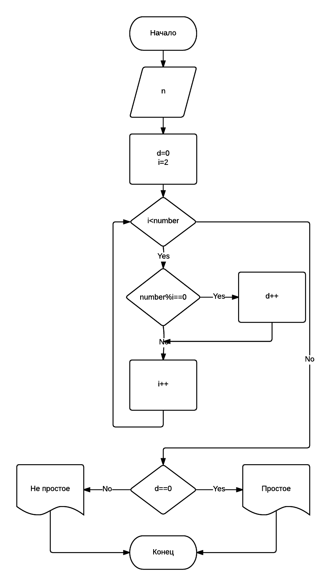
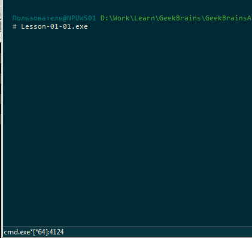
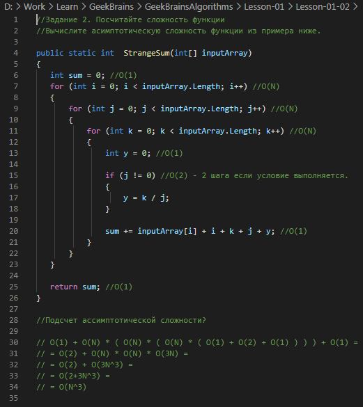
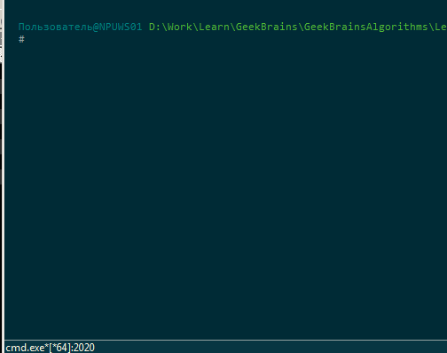

*[Назад](./../README.md)*  
  
### Задание для урока №1  
  
- [X] 1 Напишите на C# функцию согласно блок-схеме  
Требуется реализовать на C# функцию согласно блок-схеме. Блок-схема описывает алгоритм проверки, простое число или нет.  
Написать консольное приложение.  
Алгоритм реализовать отдельно в функции согласно блок-схеме.  
Написать проверочный код в main функции .  
Код выложить на GitHub.  
  
  
- [X] 2 Посчитайте сложность функции  
Вычислите асимптотическую сложность функции из примера ниже.  
  
```cs  
public static int  StrangeSum(int[] inputArray)
{
   int sum = 0;
   for (int i = 0; i < inputArray.Length; i++)
   {
       for (int j = 0; j < inputArray.Length; j++)
       {
           for (int k = 0; k < inputArray.Length; k++)
           {
               int y = 0;

               if (j != 0)
               {
                   y = k / j;
               }

               sum += inputArray[i] + i + k + j + y;
           }
       }
   }

   return sum;
}
```  
  
- [X] 3 Реализуйте функцию вычисления числа Фибоначчи  
Требуется реализовать рекурсивную версию и версию без рекурсии (через цикл).  
Пример чисел Фибоначчи:  
F(0) = 0,  
F(1) = 1.  
Для остальных чисел:  
F(N) = F(N-2) + F(N-1).  
То есть для F(2) будет F(2) = F(0) + F(1) = 0 + 1 = 1.  
F(3) будет F(3) = F(1) + F(2) = 1 + 1 = 2.  
  
---  
  
### Пояснения по выполнению задания  
  
1. Алгоритм с блок схемы реализован в методе PrimeNumberCheck, 
который выдает значение true или false (в зависимости от того простое число или нет), 
которое затем используется в main при выводе на экран сообщения о проверке числа.  
  
  
  
2. Сложность алгоритма получается O(N^3) - кубическая сложность. 
Подробный рассчет сложности приведен в файле: Lesson-01\Lesson-01-02\Lesson-01-02.txt  
  
  
  	
3. Подобное задание уже было на предыдущем курсе "Введение в c#", взял его за основу и добавил метод рассчета без рекурсии.
В программе есть следующие методы:  

```cs  
private static ulong FibonachiCycle(int n) // рассчитывает число Фибоначчи с помощью цикла  

private static ulong Fibonachi(int n, ulong[] memory) 
// рассчитывает число фибоначи с помощью рекурсии, используя массив для сохранения 
// уже вычесленных значений, для упрощения и ускорения алгоритма.  

private static ulong Fibonachi(int n) 
// стандартная рекурсия, в программе не используется, т.к. уже на числах более 50, 
// рассчеты занимают более получаса. Метод оставлен для сравнения.  
```  
  
  
  