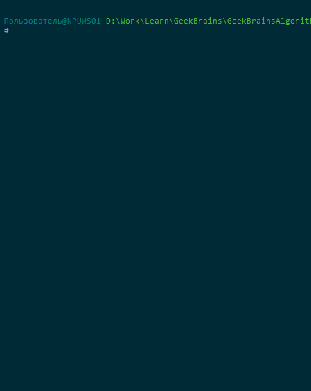
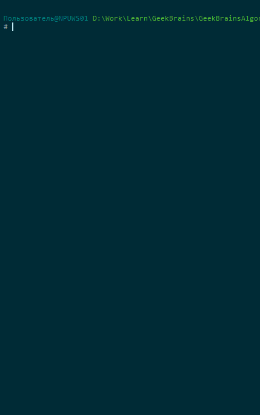

*[Назад](./../README.md)*  
  
### Задание для урока №2  
  
- [X] 1 Двусвязный список  
Требуется реализовать класс двусвязного списка и операции вставки, удаления и поиска элемента в нём в соответствии с интерфейсом.  

```cs  
namespace GeekBrainsTests
{
	public class Node
	{
    	  public int Value { get; set; }
    	  public Node NextNode { get; set; }
    	  public Node PrevNode { get; set; }
	}

	//Начальную и конечную ноду нужно хранить в самой реализации интерфейса
	public interface ILinkedList
	{
    	  int GetCount(); // возвращает количество элементов в списке
    	  void AddNode(int value);  // добавляет новый элемент списка
    	  void AddNodeAfter(Node node, int value); // добавляет новый элемент списка после определённого элемента
    	  void RemoveNode(int index); // удаляет элемент по порядковому номеру
    	  void RemoveNode(Node node); // удаляет указанный элемент
    	  Node FindNode(int searchValue); // ищет элемент по его значению
	}

}
```  
  
  
- [X] 2 Двоичный поиск  
Требуется написать функцию бинарного поиска, посчитать его асимптотическую сложность и проверить работоспособность функции.  

### Пояснения по выполнению задания  
  
1. Интерфейс ILinkedList реализовывается в классе TwoLinkedList.  
  
Дополнительно к заданным методам, добавил в интерфейс и реализовал в классе еще несколько дополнительных методов:  
```cs  
void RemoveFirst(); // удаляет первый элемент в списке
void RemoveLast(); // удаляет последний элемент в списке
void ClearList(); // очищает список
bool CheckNode(Node node); // проверяет есть ли такой элемент в списке
Node FindNodeByIndex(int index); // ищет элемент в списке по его индексу
```	 
  
В FindNodeByIndex, поиск может идти от начала или от конца списка, в зависимости от того, к чему ближе индекс.  
  
Для демонстрации работы, просто захардкодил в main простой список и несколько вызовов методов интерфейса  
с выводом результатов на консоль.  
  
  
    
2. Бинарный поиск в массиве реализован в методе private static int BinarySearch(int SearchValue, int[] array)  
Сложность алгоритма двоичного поиска будет O(logN) (логарифм степени двойки).  
Т.е например для массива размером 128 элементов, количество проходов составит 7, для 256 - 8 проходов,  
для массива размером 1000, количество проходов будет равно 10 и т.д.  
  
Для демонстрации создал массив, на 1000 элементов. Заполнил его случайными упорядоченными числами (чтобы массив был сразу отсортирован).  
Во время работы на экране выводится окно с частью массива, содержимое которого можно прокручивать клавишами 1,2,3 и 4.  
Клавиша 5 позволяет задать число для поиска в массиве, если такое число будет найдено, то указатель в окне перейдет к нужному индексу.  
Так же программа принимает параметры командной строки:  
-l <int> - количество строк массива одновременно отображаемых на экране  
-h - краткая справка  
  
  
    