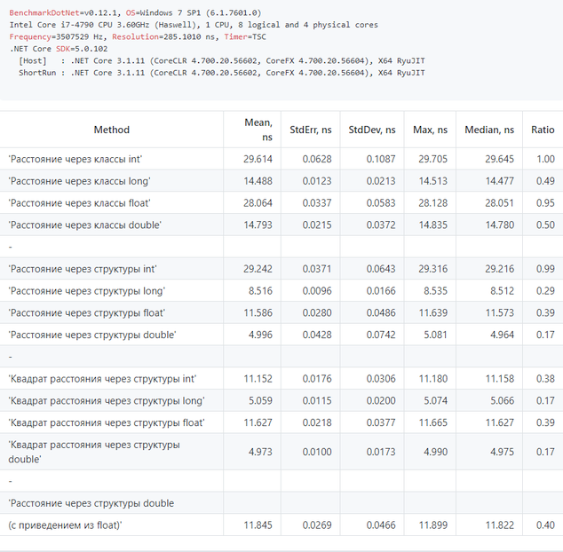

*[Назад](./../README.md)*  
  
### Задание для урока №3  
  
- [X] Протестируйте разные методы расчёта дистанции  
  
Напишите тесты производительности для расчёта дистанции между точками с помощью BenchmarkDotNet.  
  
Рекомендуем сгенерировать заранее массив данных, чтобы расчёт шёл с различными значениями,  
но сам код генерации должен происходить вне участка кода, время которого будет тестироваться.  
  
Для каких методов потребуется написать тест:  
Обычный метод расчёта дистанции со ссылочным типом (PointClass — координаты типа float).  
Обычный метод расчёта дистанции со значимым типом (PointStruct — координаты типа float).  
Обычный метод расчёта дистанции со значимым типом (PointStruct — координаты типа double).  
Метод расчёта дистанции без квадратного корня со значимым типом (PointStruct — координаты типа float).  
  
- [X] Результаты можно оформить в виде списка или таблицы, в которой наглядно можно будет увидеть время выполнения того или иного метода.  
  
---  
  
### Пояснения по выполнению задания  
  
  
  
Помимо указанных в задании методов написал еще несколько работающих с типом int, long и double.  
Так же сделал несколько массивов со случайными данными разного типа (int, long, float, double),  
чтобы для каждого типа методов был свой тип данных. Плюс добавил еще один метод с приведением типа из float в double  
  
Как это ни странно (для меня), самыми быстрыми оказались рассчеты которые ведутся с типом double, далее идет тип long, затем float.  
самые же медленные (что для меня еще страннее) - с типом int. Насколько я понял тут дело в разрядности ситемы 64 бита.  
Т.е. когда система работает с данными длиной по 8 байт (double i long), 
получаются самые маленькие накладные расходы на работу с памятью и регистрами.  
Ну а почему работа с double быстрее, чем с целочисленным long, я пока не понял. Возможно дело в том, что основная доля времени
в тестах пришлась на работу с данными, а на сами рассчеты осталось его исчезающе малая часть. Возможно дело в архитектуре
современных (относительно i7 4-го поколения и i5 7-го, не самые современные, но и не совсем старье) процессоров, т.к. по сути те же
команды извлечения корня в них уже встроены на железном уровне (причем для float и double отдельные ассемблерные команды)  
Жалко у меня нет возможности сейчас погонять подобный тест на более старых процессорах или на 32х системах.  
Было очень познавательно.  
  
  
