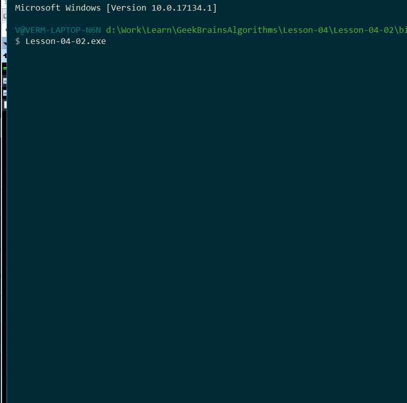

*[Назад](./../README.md)*  
  
### Задание для урока №4  
  
- [X] 1 Протестируйте поиск строки в HashSet и в массиве  
Заполните массив и HashSet случайными строками, не менее 10 000 строк. Строки можно сгенерировать.  
Потом выполните замер производительности проверки наличия строки в массиве и HashSet.  
Выложите код и результат замеров.  

- [X] 2 Реализуйте двоичное дерево и метод вывода его в консоль  
Реализуйте класс двоичного дерева поиска с операциями вставки, удаления, поиска.  
Дерево должно быть сбалансированным. Также напишите метод вывода в консоль дерева, чтобы увидеть, 
насколько корректно работает ваша реализация.  

Пример работы вывода:  

```cs  
    __(6)___
   /        \
(2)          (11)
   \        /    \
    (3)  (9)      (30)
```  
  
---  
  
### Пояснения по выполнению задания  
  
1) Сложностей с заданием не возникло.  
Поиск в хэшсете на несколько порядков быстрее чем в массиве.  
  
  
    
2) С этим деревом пришлось помучатся.  
Сначала попытался сделать дерево с нуля сам. Получилось сделать двоичное дереов поиска, 
с методами добавления и поиска. Но с удалением чисел и балансировкой вышел затык. 
Слишком много костылей лепилось.  
Поэтому пришлось на пару дней засесть за литературу, смотреть примеры в интернете.  
В итоге полностью переписать дерево.  
Получилось реализовать АВЛ дерево. Балансировка, поиск, добавление и удаление работают.  
  
  
  
Так же сделал в итоге два вида красивого вывода.  
Один, вертикальный, реализован внутри класса узла дерева.  
Второй, горизонтальный - отдельным классом.  
Примеры таких реализаций подсматривал в интернете и реализовывал под свой вариант дерева.  
  
Для работы с деревом сделал небольшую менюшку, в которой можно добавлять, удалять, 
проверять элементы в дереве. Так же можно переключать вид дерева на экране.  
  
Задание интересное и сложное. Пришлось попотеть.  
  

    