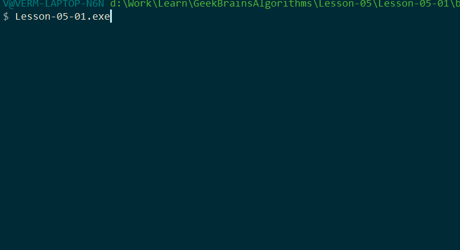

*[Назад](./../README.md)*  
  
### Задание для урока №5  
  
- [X] 1 Реализуйте DFS и BFS для дерева с выводом каждого шага в консоль. 
  
---  
  
### Пояснения по выполнению задания  
  
За основу взял бинарное дерево из 2-го задания 4-го урока.  
Добавил методы поиска чисел в ширину и глубину.  
Так же изменил визуализацию, чтобы наглядно визуализировать способы поиска (DFS, BFS и дополнительно бинарный)  
Так же изменил метод вставки нового узла в дерево, чтобы уйти от рекурсии.  
  
Примеры работы поиска в дереве:
  
  
  
  
  