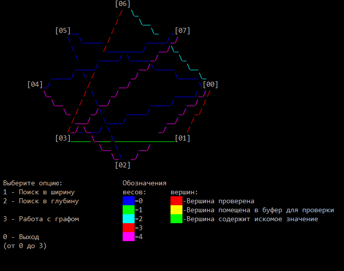
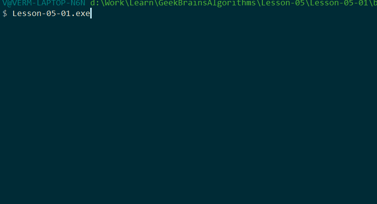
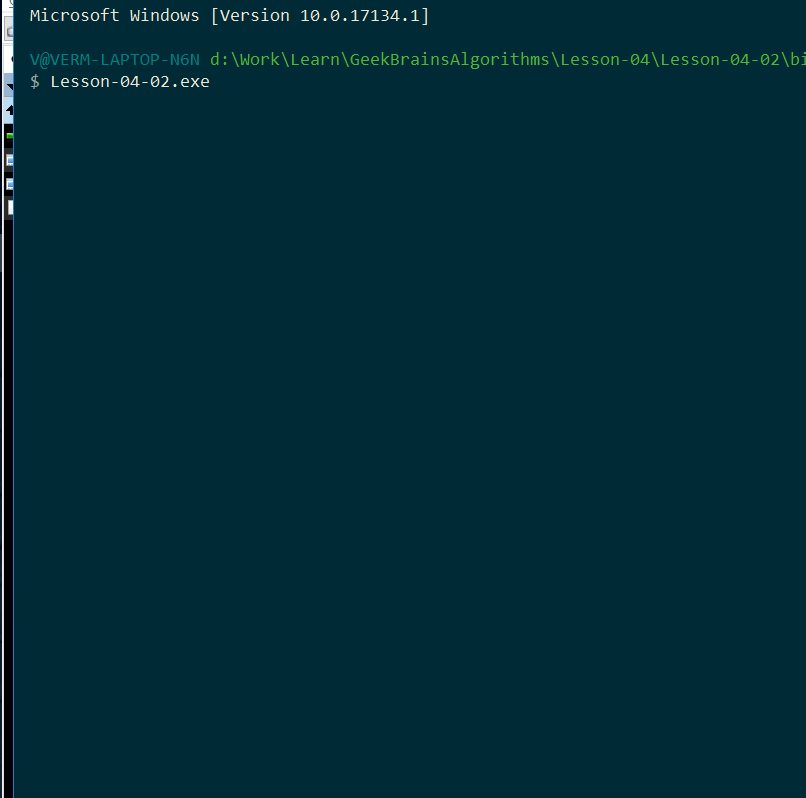
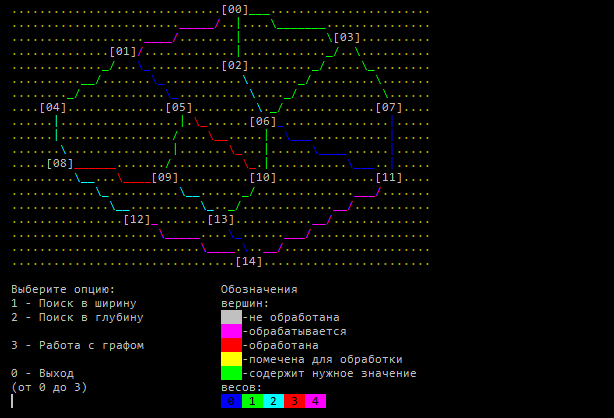
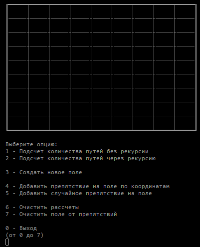

## Курс Алгоритмы и структуры данных (GeekBrains)  
  
### Репозиторий предназначен для домашних заданий  
  
---
  
### Описания заданий и пояснения к их выполнению  
  
- **[Задание урока №1 - Блок схемы. Рекурсия.](./Lesson-01/readme.md)**  
  
- **[Задание урока №2 - Двусвязанный список. Двоичный поиск.](./Lesson-02/readme.md)**  
  
- **[Задание урока №3 - Бенчмарки.](./Lesson-03/readme.md)**  
  
- **[Задание урока №4 - Реализация бинарного дерева. Хэшсеты.](./Lesson-04/readme.md)**  
  
- **[Задание урока №5 - Методы обхода дерева (DFS, BFS, бинарный)](./Lesson-05/readme.md)**  
  
- **[Задание урока №6 - Реализация графа. Методы обхода графа.](./Lesson-06/readme.md)**  
  
- **[Задание урока №7 - Динамическое программирование. Поиск с возвратом.](./Lesson-07/readme.md)**  
  
- **[Задание урока №8 - Bucket sort.](./Lesson-08/readme.md)**  
  
---  
  
### Примеры работы некоторых программ:  
  
Работа с графом:   
  
  
  
Различные способы поиска в дереве:   
  
  
  
Двоичное дерево с балансировкой:  
  
  
  
Оход графа в ширину:  
  
  
  
Рассчет количества путей:  
  
  
  
  
Курс окончен. Все домашние задания выполнены и проверены.  
  